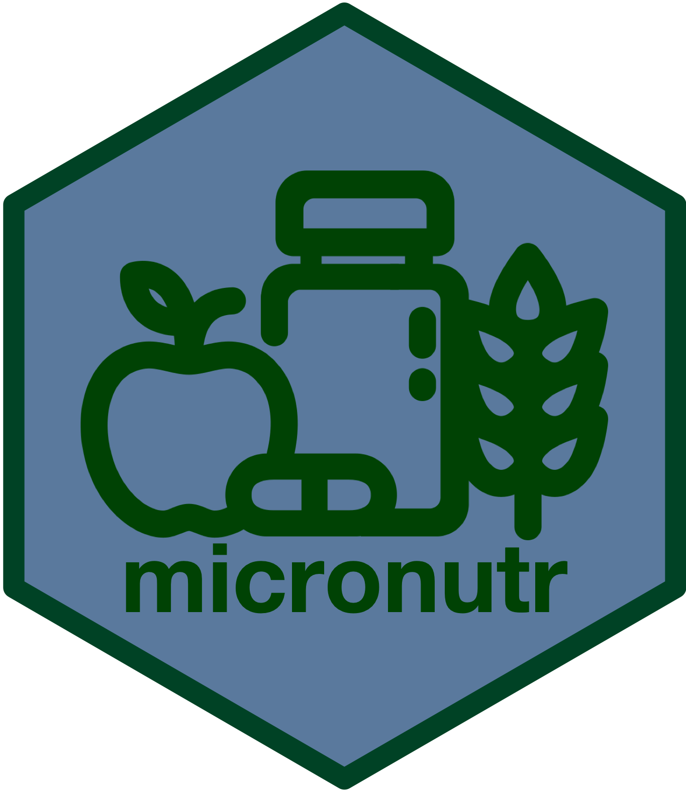

<!-- README.md is generated from README.Rmd. Please edit that file -->

```{r, include = FALSE}
knitr::opts_chunk$set(
  collapse = TRUE,
  comment = "#>",
  fig.path = "man/figures/README-",
  out.width = "100%"
)
```

# micronutr: Utilities for Calculating Indicators of Vitamin and Mineral Status of  

<!-- badges: start -->
[](https://www.repostatus.org/#wip)
[](https://lifecycle.r-lib.org/articles/stages.html#experimental)
[](https://github.com/nutriverse/micronutr/actions/workflows/R-CMD-check.yaml)
[](https://github.com/nutriverse/micronutr/actions/workflows/test-coverage.yaml)
[](https://app.codecov.io/gh/nutriverse/micronutr?branch=main)
[](https://www.codefactor.io/repository/github/nutriverse/micronutr)
<!-- badges: end -->

Vitamin and mineral deficiencies continue to be a significant public health problem. This is particularly critical in developing countries where deficiencies to vitamin A, iron, iodine, and other micronutrients lead to adverse health consequences. Cross-sectional surveys are helpful in answering questions related to the magnitude and distribution of deficiencies of selected vitamins and minerals. This package provides tools for calculating and determining select vitamin and mineral deficiencies using R.

## Installation

You can install the development version of `micronutr` from [GitHub](https://github.com/nutriverse/micronutr) with:

```{r install, echo = TRUE, eval = FALSE}
if(!require(remotes)) install.packages("remotes")
remotes::install_github("nutriverse/micronutr")
```

## Usage

## Citation

If you find the `micronutr` package useful, please cite using the suggested citation provided by a call to the `citation` function as follows:

```{r citation, echo = TRUE, eval = FALSE}
citation("micronutr")
```

## Community guidelines

Feedback, bug reports, and feature requests are welcome; file issues or seek support [here](https://github.com/nutriverse/micronutr/issues). If you would like to contribute to the package, please see our [contributing guidelines](https://nutriverse.io/micronutr/CONTRIBUTING.html).

This project is released with a [Contributor Code of Conduct](https://contributor-covenant.org/version/2/0/CODE_OF_CONDUCT.html). By contributing to this project, you agree to abide by its terms.

